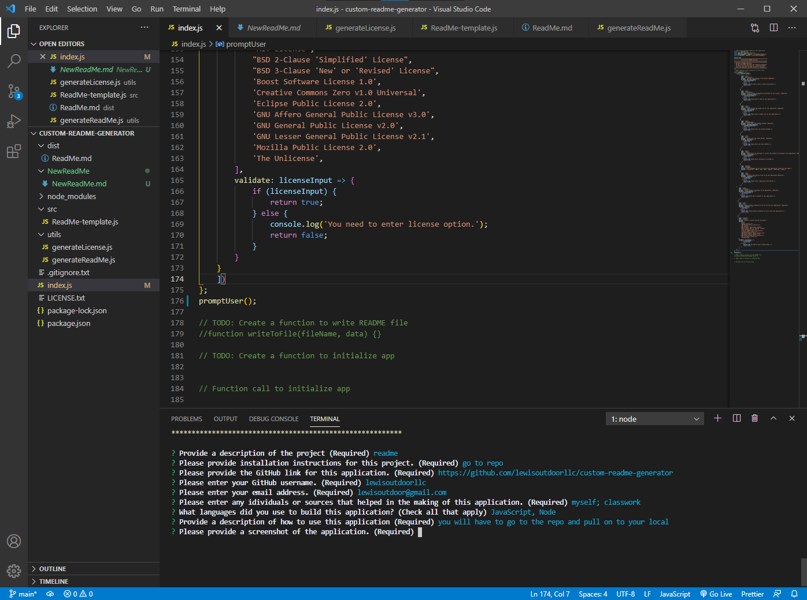

 
  # fdhsterahtre 
  
  ## Table of Contents 
  
  * [Description](#description)
  * [Installation](#installation)
  * [Languages](#languages)
  * [Usage](#usage)
  * [Screenshot](#screenshot)
  * [Test](#test)
  * [Questions](#questions)
  * [Credits](#credits)
  * [License](#license)
  
  ## Description
  sdfhgert
  
  ## Installation
  fghrseth  
  Link to GitHub Repository: https://github.com/lewisoutdoorllc/custom-readme-generator/
  
  ## Languages
  CSS
  
  ## Usage
  erfahgethetherth

  ## Screenshot
    
  

  ## Test
  dgsfhgrthwrsthrt
  ## Questions  

  GitHub Link: https://github.com/lewisoutdoorllc

  Contact via Email: efgaehaetrh

  ## Credits
  egraerhg

  ## License
  
  
    