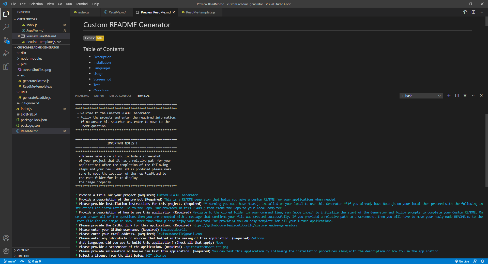

 
  # Custom README Generator 
    
  ## Table of Contents 
  
  * [Description](#description)
  * [Installation](#installation)
  * [Technology](#technology)
  * [Usage](#usage)
  * [Screenshot](#screenshot)
  * [Test](#test)
  * [Demo](#demo)
  * [Questions](#questions)
  * [Credits](#credits)
  * [License](#license)
  
  ## Description

  This is a README generator that helps you make a custom README for your applications when needed.
  
  ## Installation

  ** Warning you must have Node.js installed on your local to use this Generator ** If you already have Node.js on your local then proceed with the following instructions for installation.  
  
  Go to the Repo Link provided in this README; then clone the Repo to your local computer.   

  Link to GitHub Repository: https://github.com/lewisoutdoorllc/custom-readme-generator/ 
  
  Using your command line navigate to the cloned folder and start off by running the command “npm install”.  
  Once installed run “node index” to initialize the start of the Generator and follow prompts to complete your Custom README.
  
  ## Technology
  
  
  
  ## Usage

  Once you answer all of the questions then you are prompted with a message that confirms your file was created successfully. If you provided a relative path to a screenshot then you will have to move your newly made README to the root file for the image to show. Other than that please enjoy your new tool for providing you an easy template for all your future applications.

  ## Screenshot
    
  

  ## Test

  You can test this application by following the installation procedures along with the description on how to use the application.

  ## Demo

  [Custom README Generator DEMO](https://drive.google.com/file/d/1YjrD20ckW-h6oApcFbM7fpRoxlWMxhYQ/view)

  ## Questions  

  GitHub Link: https://github.com/lewisoutdoorllc
  
  Contact via Email: lewisoutdoorllc@gmail.com

  ## Credits
  Anthony

  ## License
  
  
  Copyright (c) 2021 Cody Lewis

Permission is hereby granted, free of charge, to any person obtaining
a copy of this software and associated documentation files (the
"Software"), to deal in the Software without restriction, including
without limitation the rights to use, copy, modify, merge, publish,
distribute, sublicense, and/or sell copies of the Software, and to
permit persons to whom the Software is furnished to do so, subject to
the following conditions:

The above copyright notice and this permission notice shall be
included in all copies or substantial portions of the Software.

THE SOFTWARE IS PROVIDED "AS IS", WITHOUT WARRANTY OF ANY KIND,
EXPRESS OR IMPLIED, INCLUDING BUT NOT LIMITED TO THE WARRANTIES OF
MERCHANTABILITY, FITNESS FOR A PARTICULAR PURPOSE AND
NONINFRINGEMENT. IN NO EVENT SHALL THE AUTHORS OR COPYRIGHT HOLDERS BE
LIABLE FOR ANY CLAIM, DAMAGES OR OTHER LIABILITY, WHETHER IN AN ACTION
OF CONTRACT, TORT OR OTHERWISE, ARISING FROM, OUT OF OR IN CONNECTION
WITH THE SOFTWARE OR THE USE OR OTHER DEALINGS IN THE SOFTWARE.
    